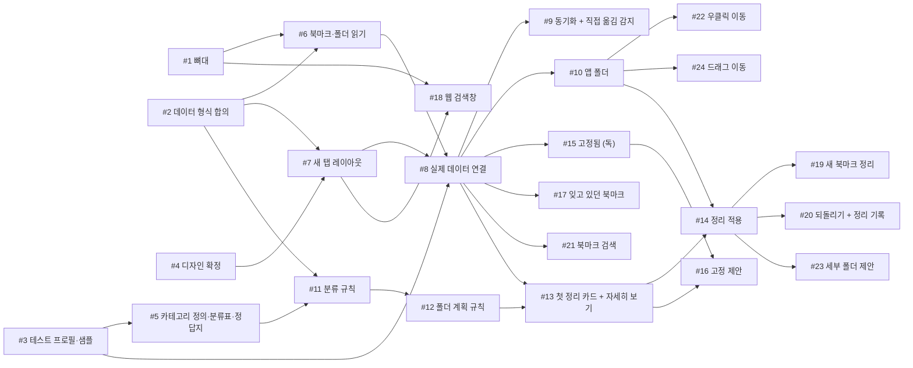

# 5주차 활동지 / Week 5 Worksheet

**1-page 기획서 / One-page plan**

- 작성일 / Date: 2026-10-06
- 참여자 / Present: 박현, 한승엽, 최윤성, 이제빈

---

## ① 주제 확정 / Confirm topic

- 확정 주제 / Topic: **브라우저 구석에 묻혀 잊히는 크롬 북마크를, 매일 여는 새 탭에 휴대폰 홈 화면처럼 앱과 앱 폴더로 보여 주고, 잊고 있던 북마크를 다시 꺼내 주며, 한 번 확인만으로 크롬 북마크에 실제로 정리해 주는 새 탭 북마크 도구 (크롬 확장 프로그램)**
- 이유 / Reason:
  - **설문으로 문제를 확인했다 (응답 48명).** 북마크 사용자 26명 중 16명(62%)이 폴더를 만들지 않았고, 자유응답에서 "저장한 이름이 기억나지 않는다", "북마크해 둔 사실 자체를 잊는다", "북마크가 눈에 안 띈다"가 반복됐다. 반면 대부분은 1분 안에 북마크를 찾았고(25명 중 12명), 북마크 수도 50개 이하가 84%였다. 그래서 문제를 "찾기 어렵다"에서 **"눈에 안 띄어 잊는다"**로 좁혔다.
  - **대상과 플랫폼이 분명하다.** 응답 46명 중 38명이 크롬을 주 브라우저로 써서 크롬 확장 프로그램이 맞다. 가장 많은 보관 방식은 카톡·메모 앱(67%)이지만, 이번 학기 대상은 북마크 사용자로 한정한다.
  - **경쟁 도구를 확인해 빈틈을 좁혔다.** 가져오기형(Tabisto, Raindrop.io)은 새 북마크가 반영되지 않았고, 뷰어형(Easy Bookmark Viewer)은 화면에서만 분류할 뿐 크롬 폴더에는 반영하지 않았다(직접 사용). 스피드 다이얼은 수동 관리형이고, AI 정리 도구(Bookmark Genie, Bookmark Scout)는 새 탭이 아니며 외부 AI와 API 키가 필요하다. **새 탭 홈 화면·자동 정리 제안·외부 전송 없음·근거와 기록·크롬 폴더 반영**을 모두 갖춘 도구는 조사한 범위에서 찾지 못했다.
  - **작은 규모에 맞춘 정리 방식이다.** 북마크 수에 따라 많은 카테고리부터 3~6개 폴더만 만들고, 애매한 북마크는 숨기지 않으며, 북마크가 적으면 폴더 대신 고정을 제안한다. 사용자가 만든 폴더와 북마크바에서 요즘 쓰는(최근 30일 안에 연) 북마크는 건드리지 않는다. 크롬 별 버튼의 기본 저장 위치가 북마크바라서, 북마크바에 흩어진 북마크를 정리 대상에 넣었다(10월 6일 변경).
  - **기술적으로 실현 가능하다.** 크롬 공식 API(`chrome.bookmarks`, `chrome.search`, 필요할 때만 `chrome.topSites`)로 읽기·변경 감지·폴더 생성과 이동·기본 검색엔진 검색을 모두 할 수 있고, 서버·DB·AI가 필요 없다. 범위는 한 PC 기준이다.

---

## ② 태스크 분해와 의존 관계 / Tasks and dependencies

### 태스크 목록 / Task list

4주차 사용자 스토리와 완료 조건을 태스크로 나눕니다.
*Break down your Week 4 user stories and acceptance criteria into tasks.*

각 태스크는 따로 끝내도 맞는지 확인할 수 있어야 합니다. 담당에 '다 같이'는 쓰지 않습니다.
*Each task must be checkable on its own. Do not write "everyone" as owner.*

기술스택: 크롬 확장 프로그램 (Manifest V3, 크롬 134 이상) · HTML / CSS / JavaScript (빌드 도구 없음, ES 모듈) · 백그라운드 서비스 워커 · SortableJS (파일로 포함) · 서버·DB·AI 없음 (크롬 북마크 + `chrome.storage.local`)

| # | 태스크 Task | 완료 조건 Done when | 선행 태스크 Depends on | 담당 Owner |
|---|---|---|---|---|
| 1 | 확장 프로그램 뼈대 (manifest: `bookmarks`·`storage`·`favicon`·`search` 권한, 선택 권한 `topSites`, 새 탭 재정의, 서비스 워커 `background.js` 등록, `minimum_chrome_version` 134) | 크롬에 `extension/` 폴더를 "압축해제된 확장 프로그램"으로 로드하면 새 탭에 확장 프로그램의 빈 페이지가 뜨고, 설치 경고에 `topSites` 경고가 나오지 않으며, 확장 프로그램 관리 화면에 서비스 워커가 오류 없이 표시된다 | 없음 | 박현 |
| 2 | 데이터 형식 합의 | 북마크, 분류 결과(카테고리 + 근거), 폴더 계획, 저장 항목(정리 기록: 원래 위치·옮긴 폴더, 직접 옮긴 북마크, 우리 화면에서 연 시각, 다시 안 볼 북마크, 고정 목록)의 필드 목록과 파일 역할이 `docs/`에 정리돼 있다 | 없음 | 팀원 B |
| 3 | 테스트용 크롬 프로필과 샘플 북마크 | 10개 미만·서로 다른 20개·30개·100개 세트(대부분 북마크바에 흩어 두고 일부만 기타 북마크·사용자 폴더에 둠. 최근 30일 안에 북마크바에서 연 북마크와 오래 안 연 북마크 포함)를 새 크롬 프로필에 가져오면 모두 보인다 | 없음 | 이제빈 |
| 4 | 디자인 확정 | 새 탭 메인(잊고 있던 북마크 폴더, 첫 정리 카드, 앱 폴더 팝업, 화면 아래의 고정됨, 북마크 검색창 포함), 정리 창(자세히 보기, [정리하기] 창), 정리 기록 화면의 시안이 확정돼 있다(10월 6일 Figma Make 시안으로 확정, 링크는 계획서 W5). 앱 아이콘은 색 타일 위에 작은 파비콘(16~32px)을 올리는 형태이고, 파비콘이 없을 때의 첫 글자 아이콘이 포함돼 있다 | 없음 | 팀원 D |
| 5 | 카테고리 정의와 분류표·정답지 | 카테고리별 정의·경계 규칙 문서가 `docs/`에, 세부 주소 단위 분류표(`categories.json`)가 `extension/data/`에, 샘플 100개에 정답 카테고리를 붙인 정답지가 `tests/`에 있다 | 3 | 팀원 B |
| 6 | 북마크·폴더 읽기 (`bookmarks.js`) | 콘솔에 출력된 북마크 개수가 크롬 북마크 관리자와 같고, 각 북마크의 위치와 저장 시각·마지막 사용 시각이 보이며, 북마크바·기타 북마크·모바일 북마크를 폴더 ID가 아닌 `folderType`으로 구별한다 | 1, 2 | 박현 |
| 7 | 새 탭 레이아웃 (앱 아이콘, 앱 폴더, 독, 반응형) | 더미 데이터로 확정된 와이어프레임과 같은 배치가 표시되고, 창을 줄이면 한 줄의 앱 개수가 줄어든다 | 2, 4 | 팀원 D |
| 8 | 실제 데이터 연결 (`render.js`) | 새 탭을 열면 기존 크롬 폴더가 앱 폴더로, 나머지 북마크가 앱으로 표시되고, 앱을 클릭하면 현재 탭에서 페이지가 열린다 | 3, 6, 7 | 팀원 D (박현과 협업) |
| 9 | 자동 동기화 + 직접 옮김 감지 (`background.js` 서비스 워커) | 별 버튼으로 저장·삭제·이동한 결과가 새로고침 없이 반영되고, 크롬 북마크 관리자에서 옮긴 북마크는 **새 탭이 닫혀 있어도** "직접 옮김"으로 기록되며, 정리 기능이 옮긴 것(옮기기 전에 저장해 둔 "옮기는 중" 표시와 목적지가 같고 1분 안에 일어난 이동)은 기록되지 않는다 | 8 | 팀원 B |
| 10 | 앱 폴더 열기·만들기·이름 바꾸기·삭제 (`view/folders.js`) | 앱 폴더를 누르면 팝업으로 펼쳐지고, 만든 폴더가 크롬 북마크 관리자에도 생기며, 삭제하면 안의 북마크는 밖으로 나오고 폴더만 사라진다 | 8 | 이제빈 |
| 11 | 분류 규칙 (`classify.js`) | 정답지 100개를 넣으면 분류표 → 주소 끝 → 제목 키워드 순서로 카테고리와 근거가 붙고, 적용률과 정확도가 계산돼 기록된다 | 2, 5 | 팀원 B |
| 12 | 폴더 계획 규칙 (`plan.js`) | 샘플 세트별로 대상 수에 맞는 폴더 개수(3~6개), 폴더당 최소 3개, 사용자 폴더 제외와 요즘 쓰는 북마크(최근 30일 안에 북마크바에서 연 것) 제외가 지켜지고, 폴더를 만들 수 없는 경우(10개 미만 또는 3개 이상 카테고리 없음)가 정확히 판별된다 | 11 | 이제빈 |
| 13 | 첫 정리 카드 + 자세히 보기 (`view/cards.js`) | 첫 새 탭에 "이렇게 묶어 볼까요?" 카드가 뜨고, 자세히 보기에서 폴더별 근거와 북마크를 보며 폴더 빼기·이름 바꾸기·북마크별 폴더 변경·북마크바 제외를 할 수 있으며(고치기는 P2), 이때 크롬 북마크는 바뀌지 않는다 | 8, 12 | 팀원 D |
| 14 | 정리 적용 (원래 위치 기록) | [정리하기]를 누르면 북마크바(`folderType`이 bookmarks-bar, 두 개면 동기화되는 쪽) 맨 뒤에 폴더가 생기고(같은 이름 재사용) 북마크바와 기타 북마크의 북마크가 옮겨지며, "폴더 N개, 북마크 N개 · [되돌리기]" 안내가 12초 동안 뜨고, 북마크별 원래 위치(폴더·순서)와 옮긴 폴더가 저장된다 | 10, 13 | 박현 |
| 15 | 고정됨 (독) (`store.js`) | 고정한 북마크가 화면 아래의 고정됨에 나타나고, 새 탭을 다시 열어도 유지되며, [+]로 고정할 북마크를 고를 수 있고 8개가 차면 [+]가 사라진다 | 8 | 박현 |
| 16 | 폴더를 못 만들 때 고정 제안 | 10개 미만 세트와 서로 다른 20개 세트에서 정리 카드 대신 "자주 쓰는 북마크 5개를 고정할까요?"가 뜨고, [고정하기]를 누를 때만 자주 방문한 사이트 목록 허락을 요청하며, 허락하면 겹치는 북마크가 먼저·거절하면 최근에 연 순으로 5개가 고정된다 | 13, 15 | 이제빈 |
| 17 | 잊고 있던 북마크 (재발견) (`forgotten.js`, `view/forgottenFolder.js`) | 앱 폴더 줄 맨 앞에 우리 화면 전용 "잊고 있던 북마크" 폴더가 개수 배지와 함께 보이고(크롬 북마크에는 생기지 않음), 열면 30일 이상 안 연 북마크(새 북마크·고정된 것 제외)가 오래 안 연 순서로 8개까지 저장일·마지막으로 연 때(기록이 없으면 "연 기록 없음")와 함께 나오며, 우리 새 탭에서 연 북마크는 연 시각이 기록돼 빠지고, "이제 안 봐도 됨"을 누른 북마크는 다시 나오지 않는다. dateLastUsed가 북마크바·관리자·주소창·우리 새 탭 중 어디서 열 때 갱신되는지 확인한 결과가 `docs/`에 있다 | 8 | 팀원 B |
| 18 | 웹 검색창 (크롬 검색 유지) | 검색어를 입력하고 Enter를 누르면 크롬 기본 검색엔진의 결과가 열리고, 주소를 입력하면 이동하며, 새 탭을 열자마자 주소창에 입력해도 평소처럼 검색된다 | 1, 7 | 팀원 D |
| 19 | 새 북마크 정리 ([정리하기]) | 새 북마크가 "새로" 표시와 함께 나타나고 버튼에 개수가 붙으며, 추천대로 또는 직접 고른 폴더로 한 번에 정리되고(원래 위치 기록 포함), 같은 카테고리가 3개 모이면 새 폴더를 제안한다 | 14 | 팀원 B |
| 20 | 정리 되돌리기 + 정리 기록 화면 (`organize.js`, `view/history.js`) | 정리 기록에서 날짜별 내역과 북마크별 "원래 위치 → 옮긴 폴더"가 보이고, 되돌리기를 누르면 그 정리에서 옮긴 북마크가 원래 폴더와 순서로 돌아가며(원래 바로 앞에 있던 북마크의 뒤에 놓아 순서를 복원, 원래 폴더가 삭제됐으면 기타 북마크로 되돌리고 안내, 그 정리가 만든 빈 폴더는 삭제), 그 뒤 직접 옮긴 북마크는 그대로 남는다 | 14 | 박현 |
| 21 | 북마크 검색 (`search.js`) | 검색창에 입력할 때마다 제목·주소가 일치하는 북마크가 폴더 안 것까지 검색창 바로 아래에 리스트(사이트 아이콘·제목·주소·폴더)로 한 번에 나타나고, 누르면 열리며, 결과가 없으면 안내 문구가 뜬다 | 8 | 팀원 D |
| 22 | 우클릭 폴더 이동 | 앱을 우클릭해 "폴더로 이동"에서 폴더를 고르면 옮겨지고 크롬 북마크 관리자에도 반영되며, "직접 옮김"으로 기록되어 다음 정리에서 다시 옮겨지지 않는다 | 10 | 이제빈 |
| 23 | 세부 폴더 제안 (`topic.js`) | 20개를 넘는 폴더에서 "북마크 3개 이상 + 사이트 2곳 이상" 조건의 주제 단어로 세부 폴더가 제안된다 | 14 | 이제빈 |
| 24 | 드래그 이동 (`dnd.js`, SortableJS) | 손잡이로 앱을 끌어 폴더에 놓으면 들어가고(폴더 위에 놓기는 SortableJS 기본 기능이 아니라 직접 구현), 바꾼 순서가 크롬 북마크에도 저장되며, "직접 옮김"으로 기록된다 | 10 | 팀원 D |

코드는 프로토타입을 쓰지 않고 처음부터 새로 만든다(10월 6일 확정). 프로토타입을 돌려서 알아낸 내용은 위 완료 조건에 이미 들어 있다. 코드는 `extension/` 폴더에, 문서는 `docs/`에, 샘플 세트와 정답지는 `tests/`에 둔다. 화면 코드는 `render.js`와 `view/` 아래 파일 4개로 나눠 한 파일을 한 사람이 맡는다. GitHub 규칙(#1과 함께)과 분류표·정답지(#5)는 문서를 모두 완성한 뒤에 시작한다.

### 의존 관계 그래프 / Dependency graph (DAG)

화살표는 "앞 태스크가 끝나야 뒤 태스크를 할 수 있다"는 뜻입니다.
*An arrow means the first task must finish before the second can start.*

**그리는 방법 / How to draw**
- 아래 예시에서 상자 이름을 바꾸고, 선후 관계 하나마다 화살표(`-->`) 줄을 하나씩 추가합니다. GitHub에서 파일을 열면 그림으로 보입니다. 미리 보려면 mermaid.live에 붙여 넣으세요.
  *Rename the boxes and add one `-->` line per dependency. GitHub shows it as a diagram. Preview at mermaid.live.*
- 태스크 표를 AI에게 주고 "Mermaid 그래프로 바꿔 줘"라고 요청해도 됩니다.
  *You can also give the task table to AI and ask "Convert this into a Mermaid graph."*
- 어려우면 종이에 그려 사진을 `docs/images/`에 올리고 ``로 넣어도 됩니다.
  *Or draw it on paper, upload the photo to `docs/images/` and link it with ``.*

- 지금 착수 가능 (진입 차수 0) / Can start now (in-degree 0): #1 뼈대, #2 데이터 형식 합의, #3 테스트 프로필·샘플, #4 디자인 확정
- 작업 순서 (위상정렬) / Work order (topological sort):
  - 1단계 (동시 착수): #1 · #2 · #3 · #4
  - 2단계: #5 · #6 · #7
  - 3단계: #8 · #11 · #18
  - 4단계: #9 · #10 · #12 · #15 · #17 · #21
  - 5단계: #13 · #22 · #24
  - 6단계: #14 · #16
  - 7단계: #19 · #20 · #23
- 사이클이 있었다면 어떻게 풀었는가 / If there was a cycle, how did you fix it?: 처음 나눌 때 "새 탭 화면(#7)을 만들려면 북마크에 어떤 정보가 있는지 알아야 하고, 북마크 읽기(#6)는 화면에 무엇을 보여 줄지 알아야 한다"는 서로 기다리는 관계가 생겼다. 공통 결정인 **#2 데이터 형식 합의**를 떼어 앞에 두어 #6과 #7을 동시에 시작할 수 있게 했다. 또 정리를 **#5 카테고리 정의 → #11 분류 규칙 → #12 폴더 계획(화면 없이 샘플과 정답지로 검증) → #13 첫 정리 카드 → #14 적용**으로 나눠, 가장 중요한 분류 정확도를 화면 완성 전에 반복 측정하고, 크롬 북마크를 실제로 바꾸는 위험한 작업(#14)은 뒤에 오게 했다.

---

## ③ 범위 결정 / Scope

### Must — 없으면 성립 안 됨 / essential

핵심 시나리오 1개가 끝까지 동작하는 데 필요한 것만 / *Only what the core scenario needs to work end-to-end*

- 핵심 시나리오 / Core scenario: 북마크를 저장만 하고 폴더는 만들지 않는 대학생이 확장 프로그램을 설치하고 새 탭을 연다 → 가운데 위 검색창(또는 주소창)에서 평소처럼 검색할 수 있고, 북마크가 앱으로 보인다 → 첫 정리 카드에 "영상 8 · 학교 6 · 블로그·글 5 · 개발 3 · 나머지 8개는 그대로"가 뜨고, [정리하기]를 누르면 크롬 북마크바에 폴더 4개가 생긴다 (북마크가 적거나 서로 달라 폴더를 못 만들면 대신 "자주 쓰는 북마크 5개를 고정할까요?"가 뜬다) → 앱 폴더 줄 맨 앞의 "잊고 있던 북마크" 폴더를 열어 3개월 전 저장한 과제 자료를 발견한다 → 새로 저장한 강의 자료가 "새로" 표시와 함께 나타나고, [정리하기]를 눌러 추천 폴더에 넣는다 → 잘못 들어간 북마크는 우클릭으로 옮기고, 마음에 안 들면 정리 기록에서 되돌린다 → 이름이 기억나지 않는 북마크는 검색창에 일부만 입력해 아래 리스트에서 찾는다.
  - 관련 태스크: #1 ~ #22
  - 개발 순서 (10월 6일 확정): 위 Must를 데모 시점에 따라 둘로 나눠 만든다. 기능은 빼지 않았다.
    - **P1 (11주 중간 데모까지):** 새 탭에서 북마크가 앱과 앱 폴더로 보인다 → 첫 정리 카드에서 [정리하기]를 누르면 북마크바에 폴더가 생긴다 → [되돌리기]로 원래대로 돌린다 → 잊고 있던 북마크를 열어 본다. 관련 태스크: #1 ~ #8, #11 ~ #14, #17, #18, #10 중 폴더 표시와 열기, #20 중 결과 안내의 [되돌리기]
    - **P2 (15주 최종 데모까지):** #9 직접 옮김 감지, #10 중 폴더 만들기·이름 바꾸기·삭제, #13 중 자세히 보기에서 고치기, #15, #16, #19, #20 중 정리 기록 화면, #21, #22
    - Should의 두 시나리오(#23, #24)는 **P3**로 둔다.

### Should (없을 경우에는 작성하지 마세요)

- 시나리오: 25개로 커진 블로그·글 폴더 안에서 "자료구조" 세부 폴더를 제안받는다. (#23)
- 시나리오: 손잡이로 앱을 끌어 폴더에 넣거나 순서를 바꾼다. (#24)

### Could (없을 경우에는 작성하지 마세요)

### **Won't — 이번 학기에 안 함 / not this semester**

| Won't 항목 Item | 포기한 이유 Why |
|---|---|
| 외부 AI로 북마크 분류·추천 | **배제형.** API 키를 숨길 서버와 사용료가 필요하고, 은행·학교·회사 내부 주소가 담긴 북마크를 외부로 보내야 한다. AI 정리 도구(Bookmark Genie, Bookmark Scout)와의 차이다 |
| 페이지 헤더 읽기·썸네일 미리보기 | **배제형.** 설문에서 미리보기 요청이 있었지만, 모든 사이트에 접속해야 해 "모든 웹사이트 데이터" 권한이 필요하고 느리다. 사이트 아이콘과 저장일로 대신한다 |
| 설치 즉시 자동 정리 | **배제형.** 사용자 동의 없이 크롬 북마크를 바꾸게 된다. 첫 화면에서 한 번 확인 후 적용한다 |
| 도구 자체 서버·회원가입·로그인 | **배제형.** 기기 간 동기화는 사용자의 크롬 로그인 동기화가 이미 맡고 있다 |
| 휴대폰 앱 | **배제형.** 안드로이드용 크롬은 확장 프로그램을 지원하지 않는다 |
| 크롬 내장 AI로 분류 보조 | **편의형.** 외부 전송은 없지만 사용자 컴퓨터에 수 GB 모델과 일정 사양이 필요하고, 한국어를 공식 지원하지 않으며, 결과가 매번 달라 검증이 어렵다 |
| 카톡·메모 앱에 저장한 링크 모으기 | **편의형.** 설문에서 가장 많은 보관 방식(67%)이지만 다른 앱의 데이터가 필요하고 범위가 커진다 |
| 여러 기기 간 기록 동기화 | **편의형.** 정리 기록·직접 옮김·고정 목록은 이 PC에만 저장한다. 이번 학기는 한 PC 기준이다 |
| 정리 이유 기록 · "왜 여기에 있나요" 표시 | **편의형.** 팀 논의로 제외했다. 분류 근거는 정리 전 자세히 보기에서만 보여 준다 |
| 폴더 안 안 연 북마크 수 배지 | **편의형.** 팀 논의로 제외했다. 잊고 있던 북마크 폴더가 같은 역할을 한다 |
| 초성 검색 | **편의형.** 팀 논의로 제외했다. 제목·주소 검색으로 충분하다 |
| 한국어 표기 (사이트 이름 한글화) | **편의형.** 팀 논의로 제외했다. 사이트 아이콘과 제목으로 충분하다 |
| 웹 검색어 자동완성 | **편의형.** 입력 중인 글자를 검색엔진 서버로 계속 보내야 한다. 자동완성이 필요하면 주소창을 쓰면 된다 |
| 다른 브라우저, 웹 스토어 정식 배포 | **편의형.** 크롬·개발자 모드 설치로 먼저 검증한다 |

### 실행 가능성 확인 / Feasibility check

- 특수 장비·유료 API·실제 개인정보가 필요한가? 필요하다면 대안은?
  *Does it need special hardware, paid APIs or real personal data? If so, what is the alternative?*
  - 특수 장비와 유료 API는 필요 없다. 정리는 AI 없이 주소와 제목 규칙으로 하고, 웹 검색은 크롬 기본 검색엔진을 그대로 쓴다.
  - 실제 개인정보: 북마크에는 민감한 주소가 들어 있고, 이 도구는 크롬 북마크를 실제로 바꾼다. 그래서 **개발과 시연 모두 팀원 본인 크롬이 아닌 테스트용 크롬 프로필과 샘플 북마크(#3)**로 진행한다. 크롬 별 버튼의 기본 저장 위치가 북마크바인 것은 테스트용 프로필에서 확인했다. 설문 원본도 팀 내부에서만 쓰고, 문서에는 집계 숫자만 싣는다.
- 15주차에 발표장에서 시연할 수 있는 형태인가?
  *Can it be demonstrated live in Week 15?*
  - 가능하다. 노트북 크롬에 확장 프로그램을 개발자 모드로 로드한 뒤 ① 새 탭에서 북마크가 앱으로 보이고 가운데 검색창으로 평소처럼 검색되는 것을 보여 주고 ② 30개 샘플 프로필에서 첫 정리 카드로 폴더가 만들어지는 것과, 10개 미만 프로필에서 고정 제안이 뜨는 것을 비교해 보여 준 다음 ③ 크롬 북마크 관리자에 같은 폴더가 생긴 것을 확인시키고 ④ 별 버튼으로 새 북마크를 저장해 [정리하기]로 추천 폴더에 넣는 것을 보여 준다. 정리는 서버 없이 동작해 발표장 인터넷 상태의 영향을 받지 않는다(웹 검색 시연만 인터넷 필요).

---

## ④ 가장 먼저 동작시킬 흐름 (Walking Skeleton) / First end-to-end flow

예 / Example: 과제 ID를 입력하면 → LMS에서 제출 기록을 받아 와서 → 화면에 제출 인원 숫자 하나가 뜬다

> [무엇을 입력하면] → [무엇을 처리해서] → [화면에 무엇이 나온다]
>
> **새 탭을 열면** → **`chrome.bookmarks`로 흩어진 북마크를 읽어 분류표로 카테고리를 정하고, 대상 수에 맞춰 폴더 계획을 세워서** → **"영상 8 · 학교 6 · 블로그·글 5 · 개발 3 · 나머지 8개는 그대로" 한 줄이 뜬다 (폴더를 만들 수 없으면 "자주 쓰는 북마크 5개를 고정할까요?"가 뜬다)**

서비스의 핵심인 분류와 폴더 계획을 가장 먼저 끝까지 연결한다. 크롬 북마크를 바꾸지 않아 안전하고, 샘플 세트를 바꿔 가며 분류 정확도와 "폴더를 만들 수 없는 경우"의 판별을 바로 확인할 수 있다. 디자인 확정(#4) 전이라도 꾸밈 없는 화면으로 확인할 수 있다.

---

> 수업 종료 시 커밋하세요 / Commit this at the end of class
> `git add docs/week-05.md && git commit -m "docs: 5주차 활동지 작성"`
